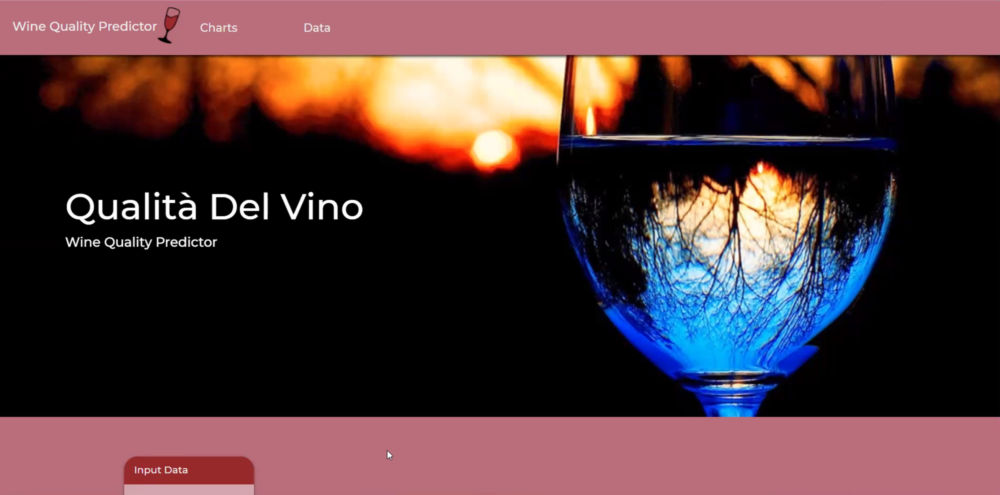
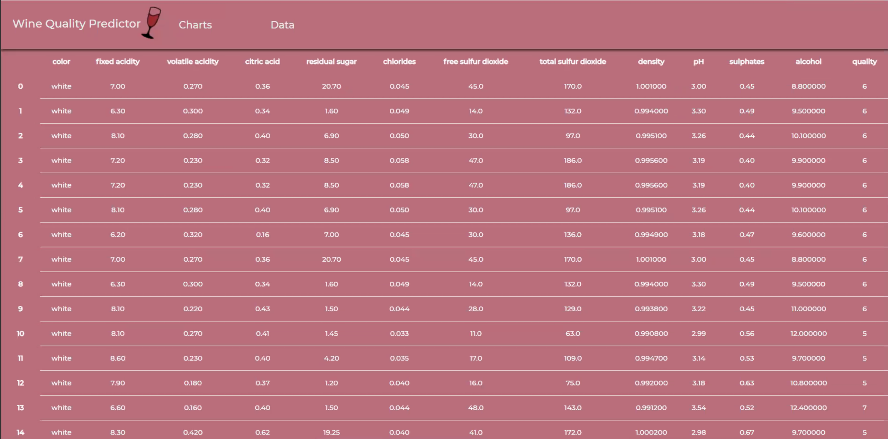
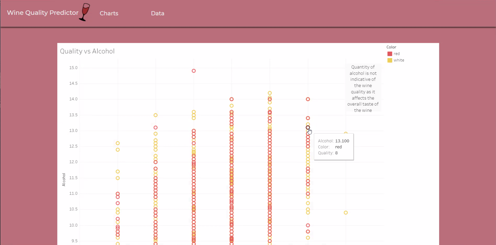

# Final-Project
# Wine Quality Predicter

The goal of this project was to explore the possibility of predicting wine quality using chemical characteristics and machine learning.

## DATA
All wine in our dataset were labeled with a quality rating from 1-10 and the following measurements:
- color	
- fixed acidity	
- volatile acidity	
- citric acid	
- residual sugar	
- chlorides	
- free sulfur dioxide	
- total sulfur dioxide	
- density	pH	
- sulphates	
- alcohol	

## MACHINE LEARNING

We created two machine learning models for red and white wine. Using random forest and linear regression. It was found that random forest fulfilled the project’s needs much better than linear regression. The ability to add new data to the training set was disabled as it could corrupt the overall profile of the original model data.

The user can input characteristics of the wine, and our predicter will push out a quality rating for your wine!

Tableau was used to analyze for trends within the data.

- Flask was used to bring the information together. 
- HTML was used to create the displays. 
- CSS and Bootstrap were used to style the data. 
- AWS was used to publish the site.
